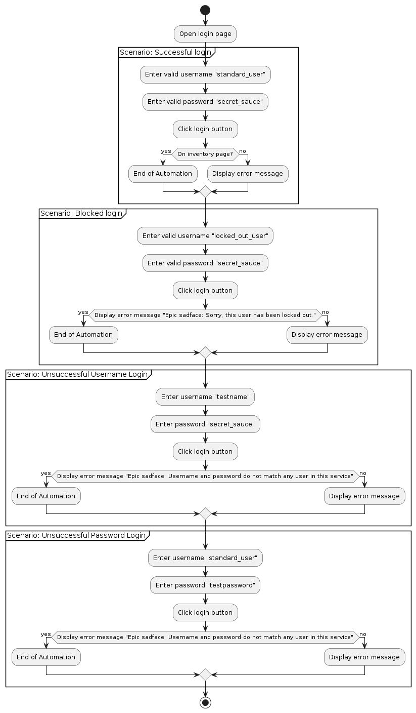
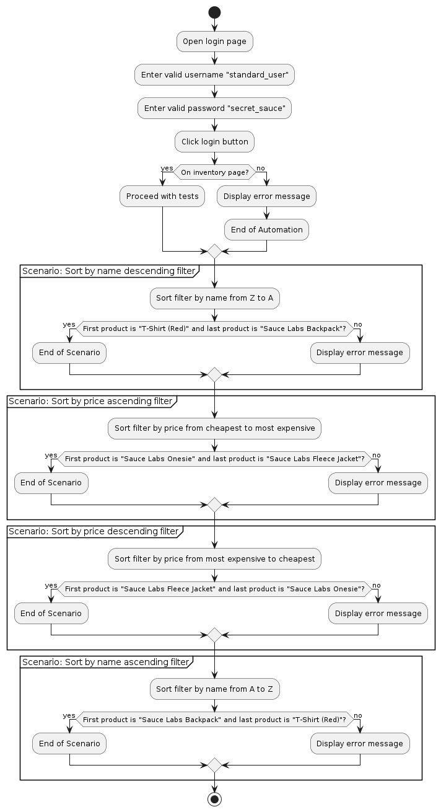
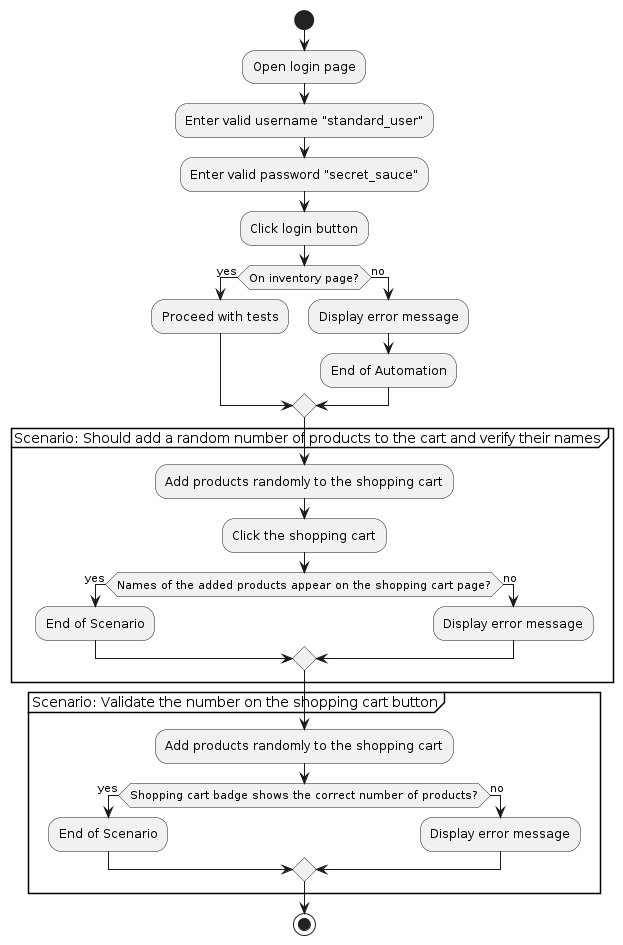
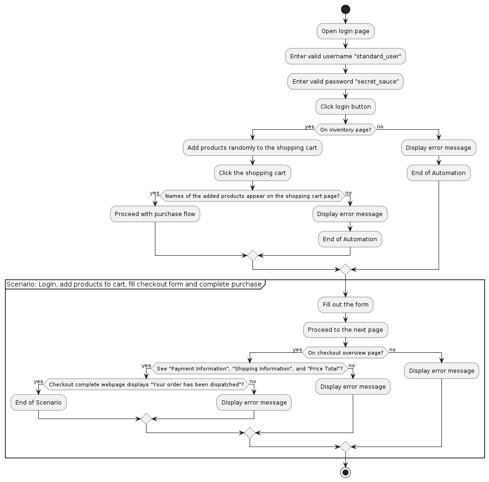

# SWAGLABS-CYPRESS-JS-BDD


## Descripción
Proyecto práctico utilizando Cypress para pruebas automatizadas, incorporando Cucumber para BDD e implementando el patrón de diseño Page Object Model (POM).

## Tecnologías usadas
- Cypress
- Cucumber
- JavaScript
- Page Object Model (POM)

## Estructura del proyecto

- **.cypress-cucumber-preprocessorrc.json**: Configuración para el preprocesador Cypress Cucumber.
- **.gitignore**: Archivo de ignorar de Git.
- **cypress.config.js**: Archivo de configuración de Cypress.
- **cypress.env.json**: Configuración del entorno para Cypress.
- **jsconfig.json**: Archivo de configuración para proyectos de JavaScript.
- **package-lock.json**: Archivo de bloqueo de dependencias.
- **package.json**: Metadatos y dependencias del proyecto.
- **README.md**: Este archivo, que proporciona una descripción general del proyecto e instrucciones de configuración.

### Carpetas del proyecto

- **cypress/**
    - **downloads/**: Carpeta para archivos descargados durante las pruebas.
    - **e2e/**: Archivos de pruebas de extremo a extremo organizados por sprints.
        - **features/**: Archivos de características de Cucumber categorizados por sprints.
            - **Sprint1/**
            - **UH1_Login.feature**: Archivo de características para la historia de usuario relacionada con la funcionalidad de inicio de sesión en Sprint 1.
            - **Sprint2/**
            - **UH2_FilteringProducts.feature**: Archivo de características para la historia de usuario relacionada con el filtrado de productos en Sprint 2.
            - **Sprint3/**
            - **UH_Cart.feature**: Archivo de características para la historia de usuario relacionada con la funcionalidad del carrito en Sprint 3.
            - **Sprint4/**
            - **UHFlow_PurchaseProducts.feature**: Archivo de características para la historia de usuario relacionada con el flujo de compra en Sprint 4.
        - **pages/**: Clases de Page Object Model (POM) para diferentes páginas de la aplicación.
            - **CartPage.js**: Objeto de página para interacciones con la página del carrito.
            - **CheckOutCompletePage.js**: Objeto de página para interacciones con la página de finalización de compra.
            - **CheckOutStep1Page.js**: Objeto de página para interacciones del paso 1 de compra.
            - **CheckOutStep2Page.js**: Objeto de página para interacciones del paso 2 de compra.
            - **InventoryPage.js**: Objeto de página para interacciones con la página de inventario.
            - **LoginPage.js**: Objeto de página para interacciones con la página de inicio de sesión.
        - **step_definitions/**: Definiciones de pasos para escenarios de Cucumber categorizados por sprints.
            - **Sprint1/**
            - **UH1_Login.js**: Definiciones de pasos para la característica de inicio de sesión en Sprint 1.
            - **Sprint2/**
            - **UH2_FilteringProducts.js**: Definiciones de pasos para la característica de filtrado de productos en Sprint 2.
            - **Sprint3/**
            - **UH_Cart.js**: Definiciones de pasos para la característica del carrito en Sprint 3.
            - **Sprint4/**
            - **UHFlow_PurchaseProducts.js**: Definiciones de pasos para la característica del flujo de compra en Sprint 4.

    - **fixtures/**: Archivos de datos de prueba o fixtures utilizados en las pruebas.
        - **example.json**: Ejemplo de datos JSON utilizados para pruebas.

    - **report/**: Informes de pruebas generados.
        - **output.html**: Archivo principal del informe HTML.
        - **output.json**: Archivo de informe JSON fusionado.
        - **mochawesome-report/**: Informes detallados de Mochawesome HTML.
        - **mochawesome.html**: Archivo principal del informe HTML de Mochawesome.
        - **mochawesome.json**: Archivo principal JSON de Mochawesome.
        - **mochawesome_001.html**, **mochawesome_001.json**: Archivos de informe adicionales de Mochawesome.
        - **assets/**: Recursos utilizados en los informes HTML (por ejemplo, CSS, JavaScript, fuentes)

    - **support/**: Archivos de soporte de Cypress.
        - **commands.js**: Comandos personalizados de Cypress.
        - **e2e.js**: Funciones o configuraciones de soporte adicionales específicas para pruebas end-to-end.

    - **videos/**: Videos de la ejecución de pruebas grabados, categorizados por sprints.
        - **Sprint1/**
            - **UH1_Login.feature.mp4**: Grabación en video de pruebas relacionadas con la funcionalidad de inicio de sesión en el Sprint 1.
        - **Sprint2/**
            - **UH2_FilteringProducts.feature.mp4**: Grabación en video de pruebas relacionadas con la funcionalidad de filtrado de productos en el Sprint 2.
        - **Sprint3/**
            - **UH_Cart.feature.mp4**: Grabación en video de pruebas relacionadas con la funcionalidad del carrito en el Sprint 3.
        - **Sprint4/**
            - **UHFlow_PurchaseProducts.feature.mp4**: Grabación en video de pruebas relacionadas con el flujo de compra en el Sprint 4.

### Scripts de ejecución

```json
"scripts": {
  "cypress:open": "cypress open", // Abrir consola Cypress
  "cypress:runner": "cypress open --e2e --browser chrome", // Ejecución por consola con navegador Chrome por defecto
  "cypress:run-all": "cypress run --reporter mochawesome && npm run merge-reports", // Ejecutar todos los test en general generando reporte
  "cypress:regression-tag": "cypress run --env tags=@regression --reporter mochawesome && npm run merge-reports", // Ejecutar solo el tag 'regression'
  "cypress:smoke-tag": "cypress run --env tags=@smoke --reporter mochawesome && npm run merge-reports", // Ejecutar solo el tag 'smoke'
  "merge-reports": "mochawesome-merge cypress/report/mochawesome-report/*.json > cypress/report/output.json && marge cypress/report/output.json --reportDir ./ --inline" // Combinar reportes
}
```

### Dependencias desarrollo
```json
"devDependencies": {
  "@badeball/cypress-cucumber-preprocessor": "^20.1.0",
  "@bahmutov/cypress-esbuild-preprocessor": "^2.1.5",
  "@faker-js/faker": "^8.4.1",
  "@shelex/cypress-allure-plugin": "^2.34.0",
  "cypress": "^13.12.0",
  "esbuild": "^0.16.4",
  "mochawesome": "^7.1.3",
  "mochawesome-merge": "^4.3.0",
  "mochawesome-report-generator": "^6.2.0",
  "multiple-cucumber-html-reporter": "^3.0.1"
}
```

### Instrucciones de Configuración

- **Clonar Repositorio/**: git clone https://github.com/TatianaCerifi/cerifi-qa-assesment/tree/nicolas-ortiz
- **Instalar Dependencias/**: npm install
- **Ejecutar la GUI de Cypress/**: npm run cypress:open
- **Ejecutar Pruebas de Cypress/**:
    - Todas las pruebas: npm run cypress:run-all
    - Pruebas de regresión: npm run cypress:regression-tag
    - Pruebas de humo: npm run cypress:smoke-tag

### Notas
  - Asegúrate de que las variables de entorno estén configuradas correctamente en cypress.env.json para los diferentes entornos de prueba.

### Diagramas de flujo
- **UH1_Login | La página de inicio de sesión funcionará de acuerdo con las credenciales del usuario.**

    

- **UH2_FilteringProducts | La página de productos debe aplicar filtros y mantener el orden.**

    

- **UH_Cart | Seleccionar productos al azar y verificarlos en el carrito de compras.**

    

- **UHFlow_PurchaseProducts | Realizar el flujo completo para la compra de productos**

    